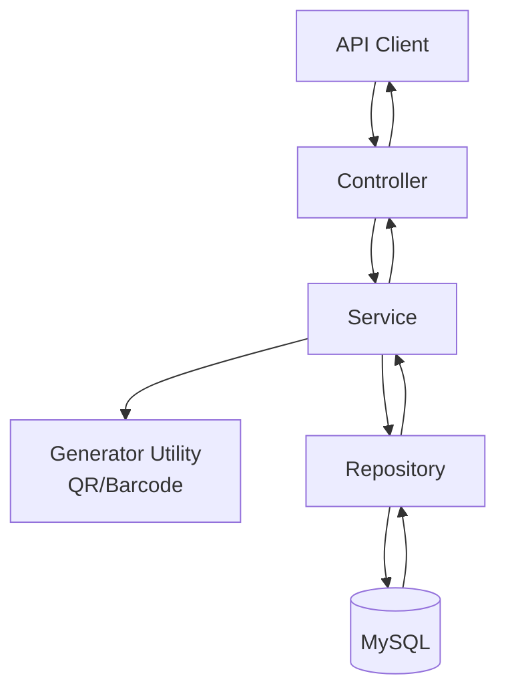
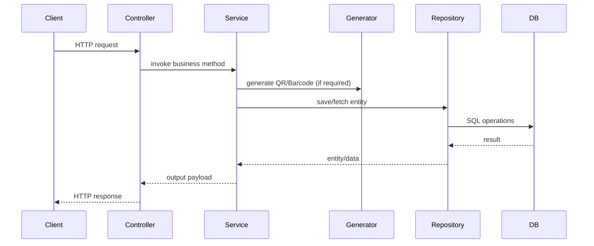

# Aadhar Service API


Aadhar Service API is a Spring Boot backend that manages Aadhaar-style citizen records and supports QR code generation, barcode generation, and image storage/retrieval through REST endpoints.

It exists as a practical backend foundation for identity-record workflows where a team needs:
- CRUD-style person registration,
- machine-readable identity representations (QR and barcode), and
- binary asset handling (image upload and retrieval).

This project is intended for backend learners, Java/Spring developers, and portfolio/demo builders who want a multi-module REST design with database persistence and generated media.

Key benefits:
- ✅ Clear controller → service → repository architecture
- ✅ Database persistence with Spring Data JPA
- ✅ QR and barcode generation using ZXing
- ✅ Multipart image upload and binary retrieval

## Features

Based on the current implementation:

- 📋 Register and list Aadhaar profile data (`Aadharreg` entity)
- 🔳 Generate and persist QR code images from Aadhaar numbers
- 🧾 Generate and persist CODE_128 barcode images from Aadhaar numbers
- 🖼️ Upload images and store them as LONGBLOB in the database
- 📥 Retrieve stored images by filename
- 💾 JPA-based persistence for all entities

## Architecture

This is a backend-only monolithic Spring Boot application.

### Frontend
- No frontend code exists in this repository.
- The API is designed to be consumed by web/mobile/desktop clients.

### Backend
- **Framework:** Spring Boot 3.4.2
- **Pattern:** Layered architecture
  - Controllers: HTTP request handling
  - Services: business logic (QR/barcode generation, image processing)
  - Repositories: database access via Spring Data JPA
  - Models: JPA entities

### Database
- Primary runtime configuration points to **MySQL** (`jdbc:mysql://localhost:3306/aadhaar`).
- JPA schema strategy is `update`.
- H2 dependency is available but not configured in `application.properties`.

### Security
- No authentication/authorization mechanism is implemented.
- No JWT/OAuth/CSRF protection is currently configured.
- One controller has permissive cross-origin enabled via `@CrossOrigin`.

### Authentication
- Not implemented.

### API Flow



## Tech Stack

| Category | Technologies |
|---|---|
| Programming Languages | Java 21 |
| Frameworks | Spring Boot, Spring Web, Spring Data JPA |
| Databases | MySQL (configured), H2 (dependency present) |
| Libraries | ZXing (`core`, `javase`) |
| Build Tools | Maven, Maven Wrapper (`mvnw`) |
| Deployment | Embedded Spring Boot server (default), configurable via standard Java deployment pipelines |

## Project Structure

```text
.
├── README.md
└── Aadhar/
    ├── pom.xml
    ├── mvnw
    ├── mvnw.cmd
    ├── .mvn/
    │   └── wrapper/
    │       └── maven-wrapper.properties
    └── src/
        ├── main/
        │   ├── java/com/example/Aadhar/
        │   │   ├── AadharApplication.java
        │   │   ├── controller/
        │   │   │   ├── maincontroller.java
        │   │   │   ├── AadhaarController.java
        │   │   │   ├── AadhaarBarcodeController.java
        │   │   │   └── ImageController.java
        │   │   ├── model/
        │   │   │   ├── Aadharreg.java
        │   │   │   ├── Aadhaar.java
        │   │   │   ├── AadhaarBarcode.java
        │   │   │   └── ImageEntity.java
        │   │   ├── repo/
        │   │   │   ├── Aadharrepo.java
        │   │   │   ├── AadhaarRepository.java
        │   │   │   ├── AadhaarBarcodeRepository.java
        │   │   │   └── ImageRepo.java
        │   │   └── service/
        │   │       ├── AadhaarQrService.java
        │   │       ├── AadhaarBarcodeService.java
        │   │       ├── ImageService.java
        │   │       ├── QRCodeGenerator.java
        │   │       └── BarcodeGenerator.java
        │   └── resources/
        │       └── application.properties
        └── test/java/com/example/Aadhar/
            └── AadharApplicationTests.java
```

### Folder Responsibilities

- `controller/` → Exposes REST APIs.
- `service/` → Contains business logic and image/code generation orchestration.
- `repo/` → JPA repositories for data persistence.
- `model/` → Entity definitions and table mapping.
- `resources/` → Runtime configuration.
- `test/` → Spring Boot context smoke test.

## Screenshots

> Add real screenshots/GIFs after connecting a frontend or API client.

- 📌 Registration/list endpoint response screenshot: `docs/screenshots/registration.png`
- 📌 QR generation and retrieval screenshot: `docs/screenshots/qr-flow.png`
- 📌 Barcode generation and retrieval screenshot: `docs/screenshots/barcode-flow.png`
- 📌 Image upload/retrieval screenshot: `docs/screenshots/image-flow.png`

## Installation

### 1) Clone Repository

```bash
git clone https://github.com/Mithun-veerabuthiran/Aadhar.git
cd Aadhar/Aadhar/Aadhar
```

### 2) Install Dependencies

```bash
./mvnw clean install
```

### 3) Configure Environment Variables / Properties

Update `src/main/resources/application.properties` for your database credentials:

```properties
spring.datasource.url=jdbc:mysql://localhost:3306/aadhaar
spring.datasource.username=root
spring.datasource.password=
spring.datasource.driver-class-name=com.mysql.cj.jdbc.Driver
spring.jpa.hibernate.ddl-auto=update
server.port=7000
```

### 4) Database Setup

- Create database: `aadhaar`
- Ensure MySQL is running
- Use a user matching your configured credentials

### 5) Run Application

```bash
./mvnw spring-boot:run
```

Base URL:

```text
http://localhost:7000
```

## Configuration

| File | Purpose |
|---|---|
| `Aadhar/pom.xml` | Maven project definition, dependencies, Java version, Spring Boot plugin |
| `Aadhar/src/main/resources/application.properties` | Application name, datasource, JPA DDL strategy, multipart size limits, server port |
| `Aadhar/.mvn/wrapper/maven-wrapper.properties` | Pins Maven wrapper distribution |
| `Aadhar/mvnw` / `Aadhar/mvnw.cmd` | Cross-platform Maven wrapper launch scripts |
| `Aadhar/.gitattributes` | Git text/binary handling defaults |
| `Aadhar/.gitignore` | Files and directories excluded from version control |

## API Documentation

### 1) Aadhaar Registration APIs

| Method | URL | Description | Request | Response |
|---|---|---|---|---|
| GET | `/` | List all registered Aadhaar records | None | JSON array of `Aadharreg` |
| POST | `/` | Create Aadhaar record | JSON body (`Aadharreg`) | Empty body (void) |

Sample POST body:

```json
{
  "name": "John Doe",
  "gender": "Male",
  "aadharnumber": "123456789012",
  "dob": "1990-01-01",
  "address": "Chennai",
  "state": "Tamil Nadu",
  "phonenumber": 987654321
}
```

### 2) QR Code APIs

| Method | URL | Description | Request | Response |
|---|---|---|---|---|
| GET | `/Qr/` | Health/sample route | None | `"final"` |
| POST | `/Qr/generate` | Generate and save QR code for Aadhaar number | Query param: `aadhaarNumber` | Success/error message |
| GET | `/Qr/get` | Fetch QR image as PNG | Query param: `aadhaarNumber` | `image/png` bytes or 404 |

### 3) Barcode APIs

| Method | URL | Description | Request | Response |
|---|---|---|---|---|
| GET | `/barcode/` | Health/sample route | None | `"final"` |
| POST | `/barcode/generate` | Generate and save CODE_128 barcode | Query param: `aadhaarNumber` | Success/error message |
| GET | `/barcode/get/{aadhaarNumber}` | Fetch barcode PNG image | Path variable: `aadhaarNumber` | `image/png` bytes or 404 |

### 4) Image APIs

| Method | URL | Description | Request | Response |
|---|---|---|---|---|
| POST | `/images/upload` | Upload an image file | Multipart form-data (`file`) | Success/error message |
| GET | `/images/{name}` | Retrieve image by filename | Path variable: `name` | JPEG bytes or 404 |

## Database Design

### Entities

1. **Aadharreg**
   - Stores basic person profile data (`name`, `gender`, `aadharnumber`, `dob`, `address`, `state`, `phonenumber`)
2. **Aadhaar** (`aadhaar_qr`)
   - Stores unique Aadhaar number and generated QR image bytes
3. **AadhaarBarcode** (`aadhaar_barcodes`)
   - Stores unique Aadhaar number and generated barcode bytes
4. **ImageEntity** (`images`)
   - Stores image filename and image binary data (`LONGBLOB`)

### Relationships

- There are no explicit JPA relationships (`@OneToMany`, `@ManyToOne`, etc.) between entities.
- Logical coupling exists through Aadhaar number usage across registration, QR, and barcode operations.

## Security

Current state (from implementation):

- ❌ Authentication: Not implemented
- ❌ Authorization/Role checks: Not implemented
- ❌ JWT/OAuth: Not implemented
- ❌ CSRF-specific policy: Not explicitly configured
- ⚠️ Input validation annotations (`@Valid`, bean constraints) are not present
- ⚠️ Error handling is per-controller and basic
- ⚠️ Sensitive data controls (encryption-at-rest for DB blobs) are not defined in code

Recommended hardening for production:
- Add Spring Security with token-based auth (JWT).
- Validate all request payloads and query parameters.
- Add centralized exception handling.
- Restrict CORS origins.
- Externalize and secure DB credentials via environment variables/secrets.

## Workflow



## Future Improvements

- Add authentication and role-based authorization.
- Normalize domain model and define explicit relationships.
- Add DTO layer and validation rules.
- Add API versioning and OpenAPI/Swagger docs.
- Add unit/integration tests for controllers and services.
- Add CI workflow with build/test status badges.
- Add Docker and production deployment manifests.

## Contributing

Contributions are welcome 🚀

1. Fork the repository.
2. Create a feature branch.
3. Make focused changes with tests.
4. Run checks locally.
5. Open a Pull Request with a clear summary.

## License

MIT License.

> Note: Add a `LICENSE` file in the repository root to formalize license terms in source control.

## Author

- **Name:** Mithun Veerabuthiran *(inferred from repository owner)*
- **GitHub:** https://github.com/Mithun-veerabuthiran
- **LinkedIn:** Not provided in repository metadata
- **Email:** Not provided in repository metadata
